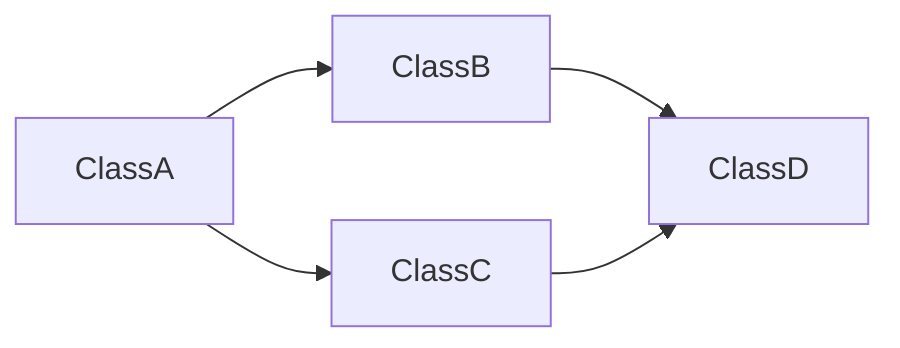

# 模块 MD 文件模板

```markdown
---
module: "module-name"
status: active|archived
total_classes: N
leaf_count: N
root_count: N
tags: [module, tag1, tag2]
---

# 模块: module-name

## 业务功能

<!-- 一句话描述模块功能 -->

## 依赖图统计

- 总类数: N
- 叶子节点: N
- 根节点: N
- 最大深度: N
- 依赖边数: N

## 包含的类

| 混淆名 | 重命名 | 职责 | 深度 | 入度 | 出度 |
|--------|--------|------|------|------|------|
| Lxxx; | ClassName | 核心逻辑 | 2 | 3 | 5 |
| Lyyy; | HelperClass | 辅助功能 | 0 | 1 | 0 |

## 类关系图



## 数据流

```
输入源
   ↓
处理器A
   ↓
处理器B
   ↓
输出
```

## 关键发现

1. 发现1
2. 发现2

## 待深入

- [ ] 待分析项1
- [ ] 待分析项2

## 历史

| 时间 | 操作 | 发现 |
|------|------|------|
| YYYY-MM-DD | 初始化 | 创建模块文件 |
```
